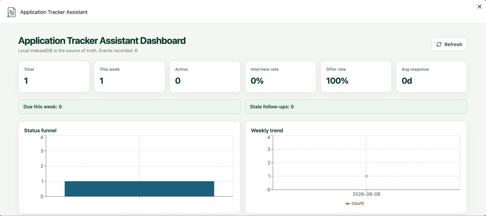
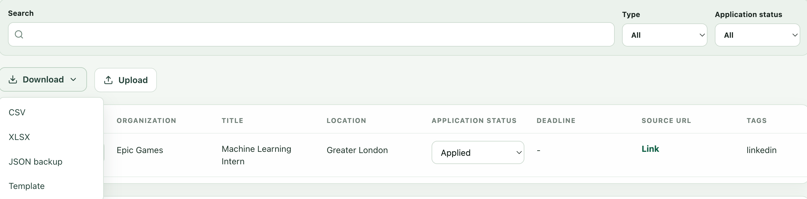

# ApplyBoard

一个轻量化浏览器扩展，用于从访问的页面中追踪职位和学校申请。

<p align="center">
  
</p>

[English](README.md) | [简体中文](README.zh-CN.md)

## 项目简介

ApplyBoard 帮助你在浏览器中高效管理申请流程：在目标页面中提取关键信息、核对并编辑内容，然后保存在本地以便后续跟踪。

该项目基于 Manifest V3 (MV3) 和 TypeScript monorepo 构建，默认将数据保存在浏览器本地，并支持 CSV、XLSX 和 JSON 导出，用于备份和分析。

## 功能特点

- 跟踪状态、截止日期、备注、标签和自定义字段，看板中可快速行内编辑
- 将记录保存在浏览器的 IndexedDB 中，快速更新信息，一键删除
- 支持 CSV、XLSX 和 JSON 格式的备份导入/导出
- 支持 Chrome 和 Edge 扩展构建

## 快速开始

### 🚀 直接安装

访问 [Chrome Web Store](https://chromewebstore.google.com/detail/fdjhphelkmbgieokmgpflcicgbloffph?utm_source=item-share-cb)

### 🔨 本地开发

**环境要求**

- Node.js 18+
- pnpm 9+

**安装依赖**

```bash
corepack pnpm install
```

**构建扩展**

```bash
corepack pnpm build # default to chrome
corepack pnpm --filter @application-tracker/extension build:edge # microsoft edge
```

该命令会为当前配置的浏览器目标生成扩展构建产物。

**在浏览器中加载扩展**

1. 打开浏览器的扩展管理页面。
2. 启用**开发者模式**。
3. 点击 **加载已解压的扩展程序**（Load unpacked）。
4. 选择以下目录：`apps/extension/output/<browser>-mv3`
5. 加载整个文件夹。

## 示例用法

<p align="center">
  
  
</p>

## 隐私说明

ApplyBoard 会将申请记录保存在浏览器本地的 IndexedDB 中。扩展仅在用户明确执行操作后才读取当前页面。默认不会向远程服务发送申请数据，导出功能也供用户自行备份和管理。

## 参与贡献

欢迎贡献代码、反馈和改进建议。请先阅读 [CONTRIBUTING.md](CONTRIBUTING.md)。

## 许可证

本项目采用 [MIT License](LICENSE) 许可证。
